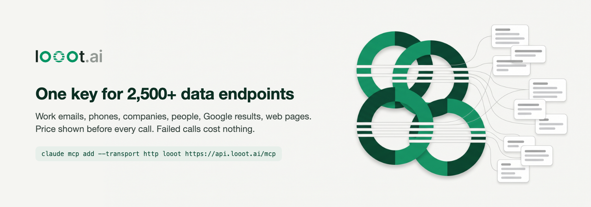

looot gives an AI agent one key and one prepaid balance for 2,500+ data API endpoints from 90+ providers: work emails, phone numbers, company and people search, Google results, web pages, news, LinkedIn profiles, local businesses. The agent searches the catalog, sees the price before it runs, and pays per call. A failed call costs nothing. Top up from $5, no subscription.

### Install

```bash
# Claude Code, or any MCP client (browser sign-in, no key in config)
claude mcp add --transport http looot https://api.looot.ai/mcp

# CLI
npm install -g looot
```

REST: `POST https://api.looot.ai/v1/runs` with a bearer token. Docs at [docs.looot.ai](https://docs.looot.ai).

### Repos

| Use looot from | Repo |
| --- | --- |
| MCP clients | [looot-mcp](https://github.com/loootai/looot-mcp) |
| Claude Code, Codex, Cursor plugin | [looot-plugin](https://github.com/loootai/looot-plugin) |
| Agent skills (`npx skills add loootai/looot-skills`) | [looot-skills](https://github.com/loootai/looot-skills) |
| GTM workflow skills (`npx skills add loootai/gtm-skills`) | [gtm-skills](https://github.com/loootai/gtm-skills) |
| TypeScript and Python | [looot-js](https://github.com/loootai/looot-js), [looot-python](https://github.com/loootai/looot-python) |
| Vercel AI SDK, LangChain | [looot-ai-sdk](https://github.com/loootai/looot-ai-sdk), [langchain-looot](https://github.com/loootai/langchain-looot) |
| n8n, Activepieces, Dify | [n8n-nodes-looot](https://github.com/loootai/n8n-nodes-looot), [looot-activepieces](https://github.com/loootai/looot-activepieces), [looot-dify](https://github.com/loootai/looot-dify) |
| VS Code, JetBrains, Zed | [looot-vscode](https://github.com/loootai/looot-vscode), [looot-jetbrains](https://github.com/loootai/looot-jetbrains), [looot-zed](https://github.com/loootai/looot-zed) |
| GitHub Actions | [looot-action](https://github.com/loootai/looot-action) |
| Chrome side panel | [looot-chrome](https://github.com/loootai/looot-chrome) |
| Docker images: CLI, MCP bridge | [looot-docker](https://github.com/loootai/looot-docker) |

| Start from a template | Repo |
| --- | --- |
| Domains in, verified work emails out (CSV) | [looot-lead-gen-agent](https://github.com/loootai/looot-lead-gen-agent) |
| Weekly Google rank report for a keyword list | [looot-seo-monitor](https://github.com/loootai/looot-seo-monitor) |
| Open-source Clay-style enrichment tables (Next.js + Supabase) | [looot-tables](https://github.com/loootai/looot-tables) |
| Buying signals on target accounts: news, hiring, page changes (Next.js + Supabase) | [looot-watchlist](https://github.com/loootai/looot-watchlist) |
| Local businesses for agencies: Maps search, website gaps, verified emails (Next.js + Supabase) | [looot-local-leads](https://github.com/loootai/looot-local-leads) |
| Add company, email, phone columns to any CSV, quote first | [looot-csv-enrich](https://github.com/loootai/looot-csv-enrich) |
| n8n workflows on core nodes: email, company research, signup score, rank check | [looot-n8n-workflows](https://github.com/loootai/looot-n8n-workflows) |
| Recipes: enrichment, research, SEO, scraping | [looot-cookbook](https://github.com/loootai/looot-cookbook) |
| 12 use cases with prices and copy-paste prompts | [awesome-looot-use-cases](https://github.com/loootai/awesome-looot-use-cases) |
| Open-source GTM engineering tools, curated | [awesome-gtm](https://github.com/loootai/awesome-gtm) |
| The whole catalog as a 3D map ([open it](https://loootai.github.io/catalog-galaxy/)) | [catalog-galaxy](https://github.com/loootai/catalog-galaxy) |
| GPT Researcher retriever plugin | [gptr-looot-retriever](https://github.com/loootai/gptr-looot-retriever) |

[looot.ai](https://looot.ai) · [Docs](https://docs.looot.ai) · [Privacy](https://looot.ai/privacy) · [Terms](https://looot.ai/terms) · [Contact](https://looot.ai/contact)
